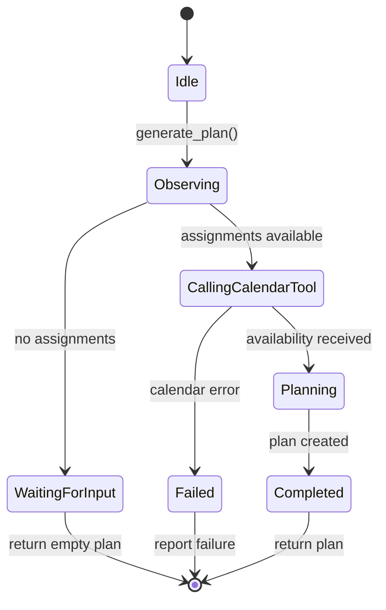

# State Machine Diagram

The state machine shows the durable situations of the agent. Transition labels are events, not states.

```mermaid
stateDiagram-v2
    [*] --> Idle

    Idle --> Observing: generate_plan()

    Observing --> WaitingForInput: no assignments
    WaitingForInput --> [*]: return empty plan

    Observing --> CallingCalendarTool: assignments available

    CallingCalendarTool --> Failed: calendar error
    Failed --> [*]: report failure

    CallingCalendarTool --> Planning: availability received
    Planning --> Completed: plan created
    Completed --> [*]: return plan
```
